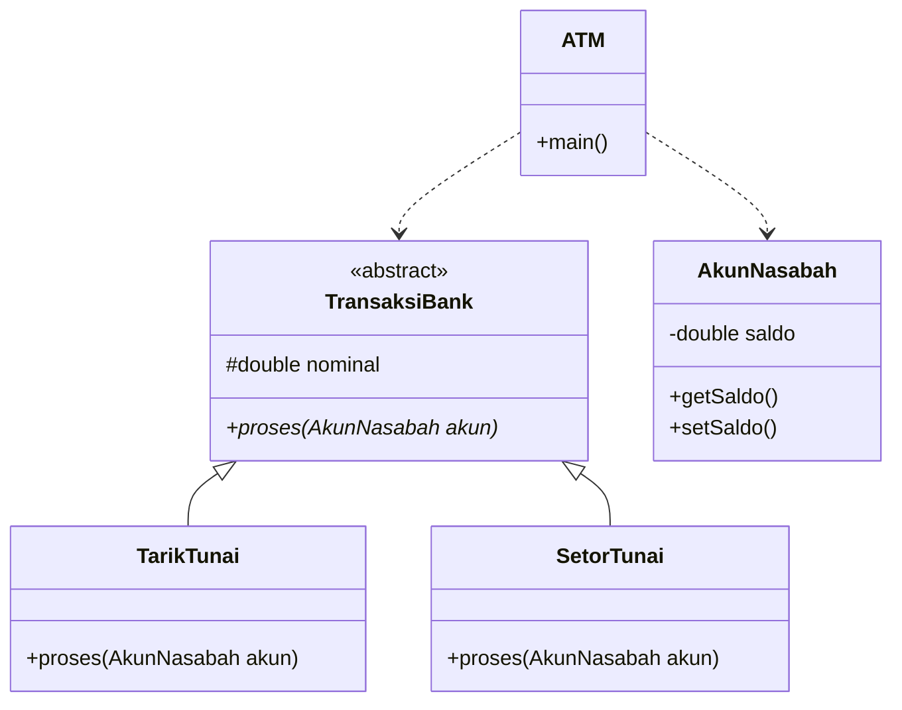

### Nama: Reyhan Adi Satrio.
### NRP: 5027251080.

# Laporan Tugas: Program ATM Sederhana (PPOB)

## 1. Deskripsi Kasus
Saya mengambil kasus sistem ATM karena sangat pas untuk menerapkan pilar OOP. Di sini ada **AkunNasabah** sebagai penyimpan data, **KartuATM** sebagai alat akses, dan **TransaksiBank** sebagai proses utamanya. Program ini bisa melakukan setor dan tarik uang dengan validasi saldo.

## 2. Class Diagram
Sesuai rancangan, saya menggunakan `abstract class` untuk transaksi agar kode lebih rapi.



## 3. Kode Program Java
```
import java.util.Date;

abstract class TransaksiBank {
    private String idTransaksi;
    protected double nominal; 

    public TransaksiBank(String id, double nominal) {
        this.idTransaksi = id;
        this.nominal = nominal;
    }

    public abstract boolean proses(AkunNasabah akun);
}

class TarikTunai extends TransaksiBank {
    public TarikTunai(String id, double jumlah) {
        super(id, jumlah);
    }

    @Override
    public boolean proses(AkunNasabah akun) {
        if (akun.getSaldo() >= nominal) {
            akun.setSaldo(akun.getSaldo() - nominal);
            System.out.println("[INFO] Berhasil tarik tunai sebesar: " + nominal);
            return true;
        }
        System.out.println("[PERINGATAN] Saldo Anda tidak cukup untuk melakukan penarikan.");
        return false;
    }
}

class SetorTunai extends TransaksiBank {
    public SetorTunai(String id, double jumlah) {
        super(id, jumlah);
    }

    @Override
    public boolean proses(AkunNasabah akun) {
        akun.setSaldo(akun.getSaldo() + nominal);
        System.out.println("[INFO] Setoran masuk sebesar: " + nominal);
        return true;
    }
}

class AkunNasabah {
    private String noRekening;
    private double saldo;

    public AkunNasabah(String noRek, double saldoAwal) {
        this.noRekening = noRek;
        this.saldo = saldoAwal;
    }

    public double getSaldo() {
        return saldo;
    }

    public void setSaldo(double saldoBaru) {
        this.saldo = saldoBaru;
    }
}

class KartuATM {
    private String idKartu;
    private Date masaBerlaku;

    public KartuATM(String idKartu) {
        this.idKartu = idKartu;
        this.masaBerlaku = new Date(); 
    }

    public boolean cekValidasi() {
        System.out.println("Sistem sedang memverifikasi kartu: " + idKartu);
        return true; 
    }
}

public class ATM {
    
    public void cetakHeader() {
        System.out.println("==================================");
        System.out.println("       BANK DIGITAL MANDIRI       ");
        System.out.println("==================================");
    }

    public void eksekusi(AkunNasabah akun, TransaksiBank aksi) {
        aksi.proses(akun);
        System.out.println("Update Saldo Terakhir: Rp" + akun.getSaldo());
    }

    public static void main(String[] args) {
        ATM mesin = new ATM();
        KartuATM kartuKu = new KartuATM("5441-xxxx-9901");
        AkunNasabah akunKu = new AkunNasabah("2024001", 1000000.0);

        mesin.cetakHeader();
        
        if (kartuKu.cekValidasi()) {
            TransaksiBank aksi1 = new TarikTunai("TX-001", 250000.0);
            mesin.eksekusi(akunKu, aksi1);

            System.out.println("----------------------------------");

            TransaksiBank aksi2 = new SetorTunai("TX-002", 500000.0);
            mesin.eksekusi(akunKu, aksi2);
        }

        System.out.println("\nTransaksi Selesai. Jangan lupa ambil kartu!");
        System.out.println("==================================");
    }
}
```
## 4. Screenshot Output


## 5. Penjelasan Prinsip OOP
* **Enkapsulasi**: Saldo saya buat `private`. Jadi tidak bisa langsung diubah-ubah dari luar tanpa lewat method `setSaldo`. Ini penting supaya uang nasabah aman dari kesalahan sistem.
* **Abstraksi**: Saya pakai `abstract class TransaksiBank`. Fungsinya sebagai template, jadi setiap ada transaksi baru (tarik atau setor), mereka wajib punya cara "proses" masing-masing.
* **Pewarisan (Inheritance)**: `TarikTunai` dan `SetorTunai` itu anak dari `TransaksiBank`. Mereka tinggal pakai variabel `nominal` dari bapaknya, tidak perlu buat baru lagi.
* **Polimorfisme**: Di method `eksekusi`, saya bisa masukkan transaksi apa saja. Program otomatis tahu mana yang harus dijalankan tanpa perlu banyak `if-else`.

## 6. Keunikan Program Saya (Personal Touch)

Agar berbeda dengan teman-teman yang lain, program saya memiliki dua poin kecil yang saya tambahkan sendiri:

1.  **Format Struk "User-Friendly"**: Saya menambahkan garis-garis pembatas sederhana (`=======`) dan pesan penutup "Jangan lupa ambil kartu" agar interaksi di terminal terasa lebih nyata seperti menggunakan mesin ATM asli di bank.
